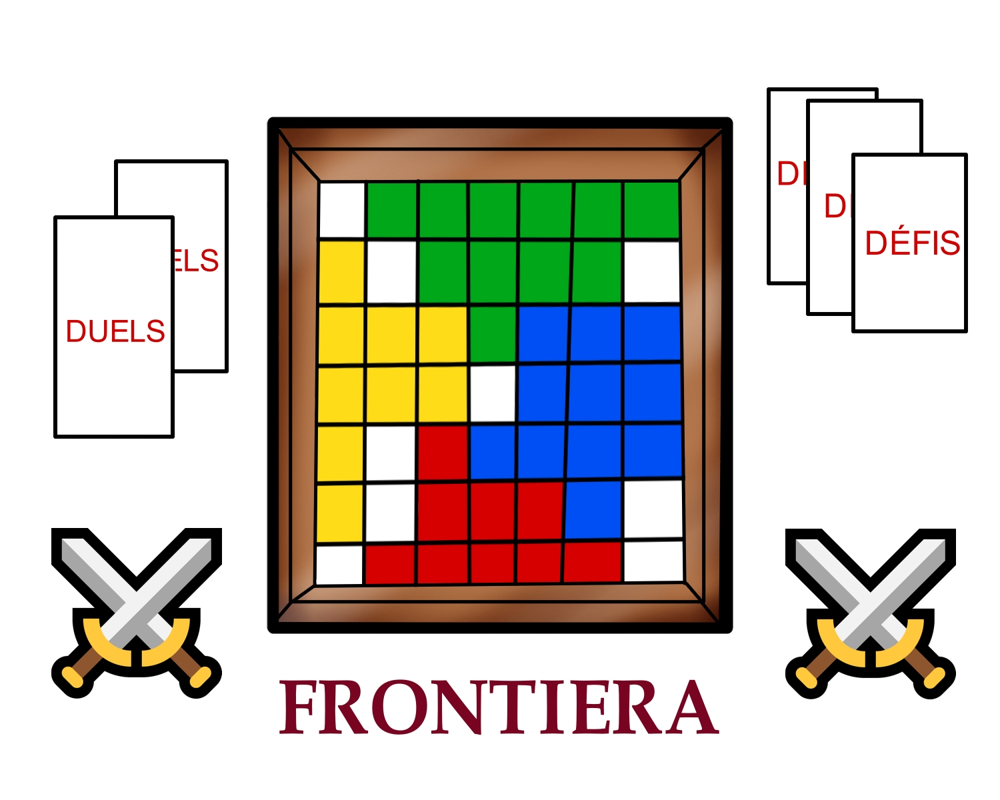

# Bienvenue sur notre documentation de l'app Frontiera

Bienvenue dans la documentation du projet Frontiera. Ce site a pour but de fournir toutes les informations nécessaires pour comprendre, utiliser et reproduire efficacement notre projet.

## À propos du Projet

* Frontiera, c'est un jeu de plateau où tu étends ton territoire en relevant des défis. Les autres joueurs vont essayer de t'en empêcher, affronte-les pour sortir vainqueur avec le plus grand territoire.

* Nous développons une application web qui permettra de jouer à Frontiera jusqu'à 4 joueurs sur le même écran. La version physique du jeu est en développement [ici](https://github.com/Makerspace-Amiens/2024-FrontieraBoardGame). 

## Poster

## Vidéo
Vidéo de présentation du projet

<video src="images/Video_Promo_Frontiera_Site.mp4" controls title="Title"  style="width: 100%;"></video>

---
